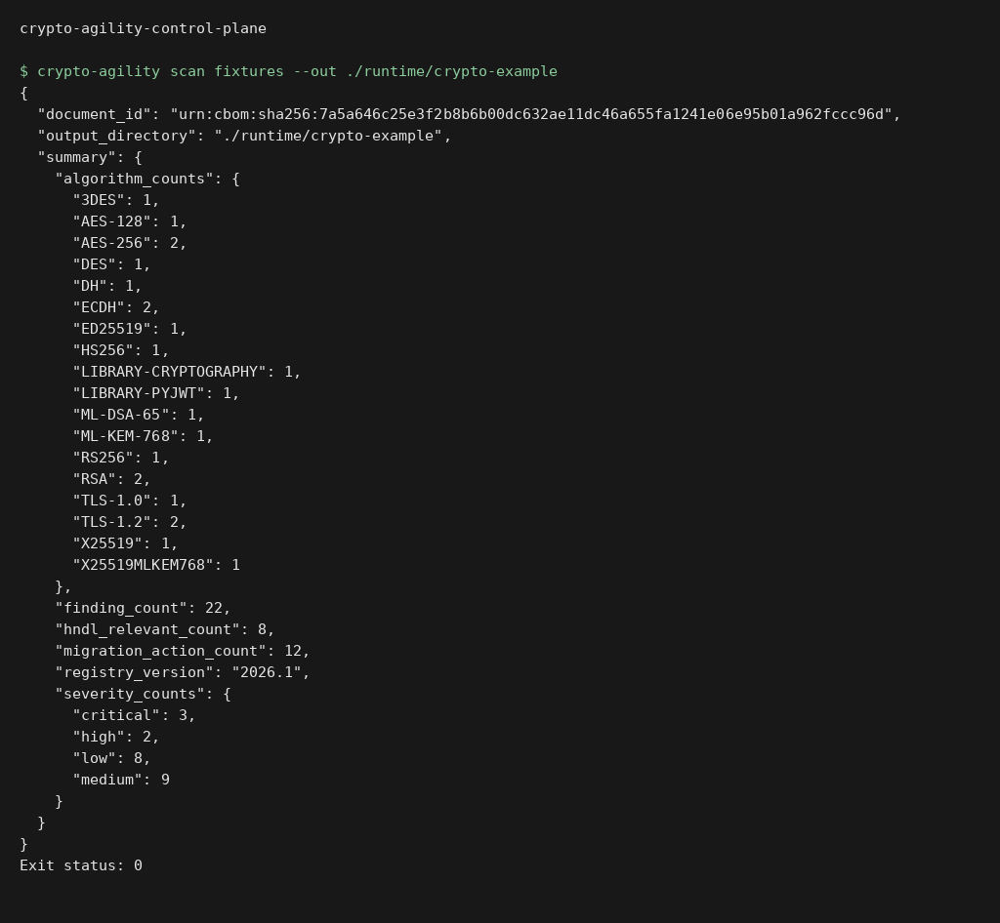

# crypto-agility-control-plane

An evidence-driven control plane for finding cryptography, producing a versioned Crypto
Bill of Materials (CBOM), prioritising migration risk, and **measuring** classical versus
post-quantum transition profiles.

The project is deliberately strict about terminology:

| Profile | What is measured | What is not claimed |
|---|---|---|
| Standard TLS | TLS 1.3 with X25519 forced on both peers | Post-quantum confidentiality |
| True hybrid TLS | A wire-parsed TLS 1.3 ServerHello carrying `X25519MLKEM768` (`0x11ec`) | Universal client or browser compatibility |
| Experimental application encapsulation | Real ML-KEM-768 and ML-DSA-65 calls through pinned liboqs 0.16.0 | TLS negotiation, an ML-DSA certificate, or a standards-track application protocol |

If OpenSSL 3.5 or the exact native liboqs build is missing, the benchmark stops. It never
substitutes simulated timings or hard-coded numbers.

## Execution preview



Local execution of `crypto-agility scan fixtures --out ./runtime/crypto-example`. The input and output shown come from the repository example or test fixtures. [Verification](docs/verification.md).

## What is implemented

- bounded, symlink-safe inventory of TLS, SSH, JWT headers, PEM certificates and keys,
  dependency manifests, and cryptographic configuration;
- opt-in probes for explicitly named TLS and SSH targets (no discovery scan);
- CBOM schema `1.0.0`, deterministic document identity, evidence digests, and golden fixtures;
- transparent risk scoring using algorithm status, key size, exposure, confidentiality
  duration, and a configurable harvest-now-decrypt-later planning horizon;
- migration actions sequenced as classical hardening → hybrid transition → PQC target,
  with prerequisites, acceptance tests, rollback, and compatibility caveats;
- real p50/p95 wall and CPU measurements, wire sizes, key/message sizes, process RSS,
  throughput, environment capture, and a client/server policy matrix;
- two TLS microservices: a classical service and a hybrid-preferred service whose client
  rejects a connection unless the observed ServerHello uses the required group;
- a bounded ML-KEM/ML-DSA application-envelope exchange on the hybrid service;
- CLI, REST API, local dashboard, hardened multi-stage container, Compose lab, tests, and CI.

## Architecture

```text
Explicit files / endpoints
          │
          ▼
  bounded inventory ── evidence location + digest (never copied secret values)
          │
          ▼
  versioned CBOM ── deterministic risk ── migration plan
          │                                  │
          ├──────── API + dashboard ─────────┤
          │                                  │
          ▼                                  ▼
 TLS MemoryBIO benchmark             classic / hybrid services
 ServerHello wire parser             verifying demo client
          │                                  │
          └──────── native liboqs 0.16.0 ────┘
                    ML-KEM-768 / ML-DSA-65
```

The LLM is not part of the scoring, inventory, protocol negotiation, or benchmark path.
Every decision and metric is deterministic or directly observed.

## Quick start

Prerequisites: Python 3.12, [uv](https://docs.astral.sh/uv/), a C compiler, CMake, and
OpenSSL 3.5+ for the hybrid TLS measurements.

```bash
uv sync --extra dev --frozen
./scripts/build-liboqs.sh .local/oqs

uv run crypto-agility scan fixtures/inventory --out reports/generated

OQS_INSTALL_PATH="$PWD/.local/oqs" \
LD_LIBRARY_PATH="$PWD/.local/oqs/lib" \
uv run crypto-agility benchmark \
  --iterations 25 \
  --out reports/generated/benchmark.json
```

The scan writes `cbom.json` and `report.md`. The benchmark writes structured JSON plus a
Markdown report beside it. The report captures Python, OpenSSL, liboqs, OS, CPU, sample
count, validation outcomes, and the SHA-256 of the loaded native library.

### Local dashboard and API

Only roots listed on the command line may be scanned through the API. Bind to loopback
unless an authentication and reverse-proxy layer is added.

```bash
OQS_INSTALL_PATH="$PWD/.local/oqs" \
LD_LIBRARY_PATH="$PWD/.local/oqs/lib" \
uv run crypto-agility api \
  --host 127.0.0.1 \
  --port 8080 \
  --allowed-root "$PWD/fixtures" \
  --oqs-install-path "$PWD/.local/oqs"
```

Open `http://127.0.0.1:8080`; OpenAPI is at `/api/docs`.

```bash
curl -fsS http://127.0.0.1:8080/healthz
curl -fsS -X POST http://127.0.0.1:8080/api/v1/scans \
  -H 'content-type: application/json' \
  -d "{\"local_path\":\"$PWD/fixtures/inventory\",\"confidentiality_years\":12}"
```

The HTTP scan endpoint intentionally has no endpoint-probe fields, reducing SSRF risk.
Named network probes remain an explicit CLI-only action.

## Classical and hybrid microservices

Generate a short-lived lab CA and certificate, then start both profiles:

```bash
uv run crypto-agility generate-lab-cert --out .state/certs

uv run crypto-agility demo-server \
  --mode classic --host 127.0.0.1 --port 9443 \
  --certificate .state/certs/server.pem \
  --private-key .state/certs/server-key.pem

OQS_INSTALL_PATH="$PWD/.local/oqs" LD_LIBRARY_PATH="$PWD/.local/oqs/lib" \
uv run crypto-agility demo-server \
  --mode hybrid --host 127.0.0.1 --port 9444 \
  --certificate .state/certs/server.pem \
  --private-key .state/certs/server-key.pem
```

In separate terminals, run the verifying clients:

```bash
uv run crypto-agility demo-client \
  --mode classic --host localhost --port 9443 \
  --ca-certificate .state/certs/ca.pem

OQS_INSTALL_PATH="$PWD/.local/oqs" LD_LIBRARY_PATH="$PWD/.local/oqs/lib" \
uv run crypto-agility demo-client \
  --mode hybrid --host localhost --port 9444 \
  --ca-certificate .state/certs/ca.pem
```

The hybrid client captures raw TLS records around a Python `MemoryBIO`, parses the
ServerHello key share, and fails closed unless it sees `0x11ec`. It then runs a separate,
explicitly labelled application exchange:

1. the server provides ephemeral ML-KEM and ML-DSA public keys inside the authenticated
   ECDSA TLS channel;
2. the client encapsulates with ML-KEM-768;
3. the server decapsulates, produces an HMAC confirmation, and signs the bound transcript
   with ML-DSA-65;
4. the client verifies both results.

This application signature demonstrates the primitive and downgrade-bound transcript; it
does not replace the ECDSA TLS certificate or assert an external trust model.

## Inventory safety model

- Files must be beneath the explicit root. Symlinks and common dependency/build trees are
  skipped; files over 2 MiB are skipped by default.
- PEM metadata is parsed in memory. Output contains fingerprints, key size, curve, and
  validity dates—not key bytes, certificate subjects, or issuer names.
- JWT inspection decodes the header only. Payload and signature are never copied; a token
  fingerprint is emitted for correlation.
- Evidence contains source, line/handshake locator, detector, confidence, and a hash of a
  normalized excerpt. It cannot be used to recover the value.
- TLS certificate validation is on by default. The lab-only bypass requires the explicit
  `--insecure-tls-probe` or `--insecure` flag and is recorded in output.
- SSH probing uses only the banner and `ssh-keyscan`; it never attempts authentication.

See [threat model](docs/threat-model.md) and [CBOM format](docs/cbom-schema.md).

## Risk and HNDL model

`config/risk-policy.yaml` is versioned and reviewable. The score is additive and capped at
100:

```text
algorithm registry base risk
+ exposure weight
+ below-policy key-size penalty
+ HNDL planning-horizon weight
+ private-key-presence weight
```

The HNDL flag is true only for a quantum-vulnerable public-key primitive whose configured
confidentiality horizon reaches the organisation's transition target (or exceeds the
minimum retention threshold). It is a prioritisation rule—not a prediction of when a
cryptographically relevant quantum computer will exist. Every component appears in the
assessment's `reasons` array.

## Reproducible benchmark protocol

Each TLS sample creates fresh `SSLObject` instances and captures both wire directions.
Session tickets are disabled. Before metrics are retained, the cleartext TLS 1.3
ServerHello is parsed and the expected key-share group is checked. The PQC suite validates
equal KEM secrets, a valid ML-DSA signature, and rejection of a tampered message. A failed
check discards the run.

Reported distributions use nearest-rank p50/p95 over independent samples. CPU uses process
time; wall latency uses a monotonic high-resolution clock. RSS is explicitly process-level
baseline/high-water telemetry, not per-operation allocation. Read the complete
[benchmark protocol](docs/benchmark-protocol.md) before comparing hosts.

## Standards and implementation sources

- [NIST FIPS 203, Module-Lattice-Based Key-Encapsulation Mechanism Standard](https://csrc.nist.gov/pubs/fips/203/final)
- [NIST FIPS 204, Module-Lattice-Based Digital Signature Standard](https://csrc.nist.gov/pubs/fips/204/final)
- [NIST FIPS 205, Stateless Hash-Based Digital Signature Standard](https://csrc.nist.gov/pubs/fips/205/final)
- [OpenSSL 3.5 supported groups and hybrid group API](https://docs.openssl.org/3.5/man3/SSL_CTX_set1_curves/)
- [Open Quantum Safe liboqs](https://github.com/open-quantum-safe/liboqs)

The native build pins liboqs `0.16.0`, verifies the source archive SHA-256, disables its
optional OpenSSL acceleration dependency, and compiles only ML-KEM-768 and ML-DSA-65. The
Python layer uses a narrow direct binding to the documented C API and refuses any other
library version.

## Verification

```bash
make lint
make typecheck
make test
./scripts/verify-environment.sh
docker compose up --build
```

Compose publishes the dashboard on `127.0.0.1:18080` and the two lab services on
`127.0.0.1:19443` / `127.0.0.1:19444` by default. Override the corresponding
`CONTROL_PLANE_PORT`, `CLASSIC_SERVICE_PORT`, or `HYBRID_SERVICE_PORT` environment variable
if needed.

Tests cover redaction, deterministic IDs, schema validation, risk factors, migration
boundaries, ServerHello parsing, exact native primitive sizes/validation, API root
enforcement, and golden fixture output. Native tests are marked `integration` and skip
with an explicit reason when the pinned library is not available; they never fabricate a
passing measurement.

## Limitations

- This is an inventory and transition laboratory, not a production secrets scanner, PKI,
  HSM control plane, or compliance certification.
- Text configuration detection is evidence with a confidence score; it may identify a
  disabled or commented setting. Parsed keys, certificates, JWT headers, and handshakes
  have higher confidence.
- A service using the OpenSSL 3.5 default hybrid preference can still negotiate a classical
  fallback with a classical-only peer. The provided hybrid demo client rejects fallback;
  operators must define server-side fallback policy for their own stack.
- Compatibility results apply only to the exact client/server environment captured in the
  report. No browser, mobile, load-balancer, or vendor appliance support is inferred.
- Pure-PQC transport migration is intentionally a planning target. The demo does not invent
  a pure-ML-KEM TLS profile or an ML-DSA TLS certificate deployment.

## Repository map

```text
src/crypto_agility/   scanner, risk, migration, benchmark, API, dashboard, lab
data/                 versioned algorithm registry
config/               versioned risk policy
schemas/              CBOM JSON Schema
fixtures/             synthetic, non-secret input corpus
tests/                unit, golden, API, and native integration tests
reports/              checked-in reproducible evidence and generated output
scripts/              pinned liboqs build and environment verification
docs/                 architecture, threat model, format, and methodology
```

Licensed under the MIT License.
